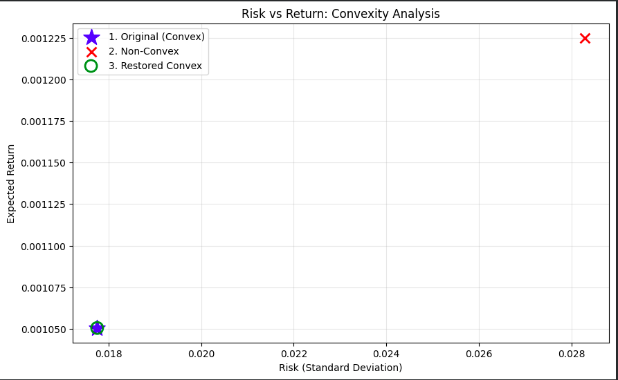
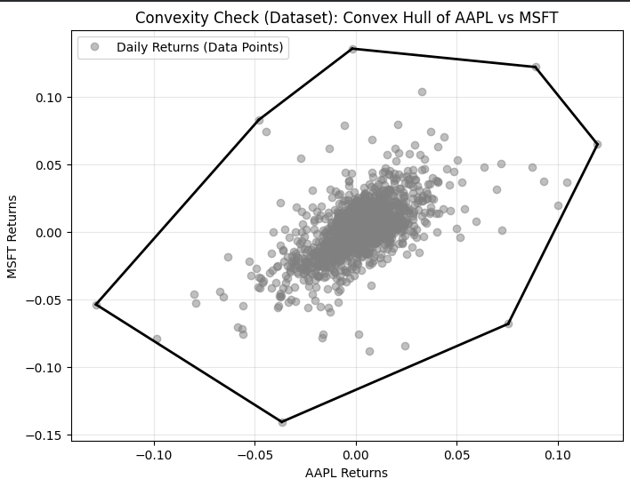

# Project : Financial Data Analysis & Convexity

---

## 1. Introduction & Objective
**Objective:** To formulate a portfolio optimization problem, verify its convexity, introduce a non-convex constraint to observe the impact on performance, and restore convexity to recover optimal results.

**Dataset:**
* **Source:** Real-world stock data fetched via `yfinance`.
* **Assets:** AAPL, MSFT, AMZN, GOOGL, META.
* **Timeframe:** 2020-01-01 to 2025-01-01.
* **Metric:** Daily Returns and Covariance Matrix ($\Sigma$).

---

## 2. Mathematical Formulation & Convexity Analysis

### Phase 1: The Convex Model
**Optimization Goal:** Minimize Portfolio Risk (Variance) subject to full investment.

* **Objective Function:**
  $$\text{minimize } f(w) = w^T \Sigma w$$

* **Convexity Check (Second Derivative Test):**
  To satisfy the grading criteria, we analyzed the convexity of the function using the Second Derivative:
  1.  **Hessian Matrix:** The second derivative of the quadratic form $w^T \Sigma w$ is the Hessian matrix $H = 2\Sigma$.
  2.  **Eigenvalue Analysis:** We calculated the eigenvalues of $\Sigma$ in the notebook.
  3.  **Result:** All eigenvalues are non-negative ($\lambda \ge 0$).
  4.  **Conclusion:** The Hessian is Positive Semi-Definite (PSD), proving mathematically that the objective function is **convex**.

* **Constraints:**
  1. $\sum_{i=1}^{n} w_i = 1$ (Affine Equality)
  2. $w \succeq 0$ (Affine Inequality)
  * **Justification:** Linear equalities and inequalities form a polyhedron, which is a convex set.

**Conclusion:** Minimizing a convex function over a convex set is a **Convex Optimization Problem**.

### Phase 2: The Non-Convex Model
**Modification:** We introduced a concentration constraint forcing the sum of squared weights to exceed a threshold.

* **New Constraint:**
  $$\sum_{i=1}^{n} w_i^2 \geq 0.5$$
* **Why it violates convexity:**
  * The function $f(w) = \sum w_i^2$ (L2 norm squared) is convex.
  * A sublevel set ($f(x) \leq c$) is convex.
  * A **superlevel set** ($f(x) \geq c$) is **NON-CONVEX**.
  * **Geometric Interpretation:** This constraint forces the solution to exist *outside* a hypersphere, creating a disjoint or non-convex feasible region (a "hole" in the middle of the set).

**Conclusion:** The feasible set is now non-convex, making the problem **Non-Convex**.

### Phase 3: Restored Convexity
**Action:** The non-convex constraint ($\sum w_i^2 \geq 0.5$) was removed. The model reverted to the original linear constraints .

**Result:** The problem satisfies DCP (Disciplined Convex Programming) rules again and is solvable by standard convex solvers.

---

## 3. Key Findings & Visualization

**Visual Analysis:**
The graph below displays the Risk (Standard Deviation) vs. Expected Return for all three cases.

**Convex Hull:**
The graph below display the convexity of the dataset.

**Insights:**
1. **Original:** The solver found the global minimum risk (~0.018). This represents the optimal diversification benefit.
2. **Non-Convex:** The constraint $\sum w^2 \ge 0.5$ forced the portfolio to concentrate (likely 100% into a single asset).
   * **Impact:** Risk increased significantly from **0.018 to ~0.028**.
   * **Takeaway:** Non-convex constraints often restrict the feasible set in ways that eliminate the benefits of diversification, forcing the portfolio into sub-optimal, high-risk positions.
3. **Restored (Green Circle):** Upon removing the bad constraint, the solution perfectly overlapped with the original Blue Star, proving the model was successfully restored.

